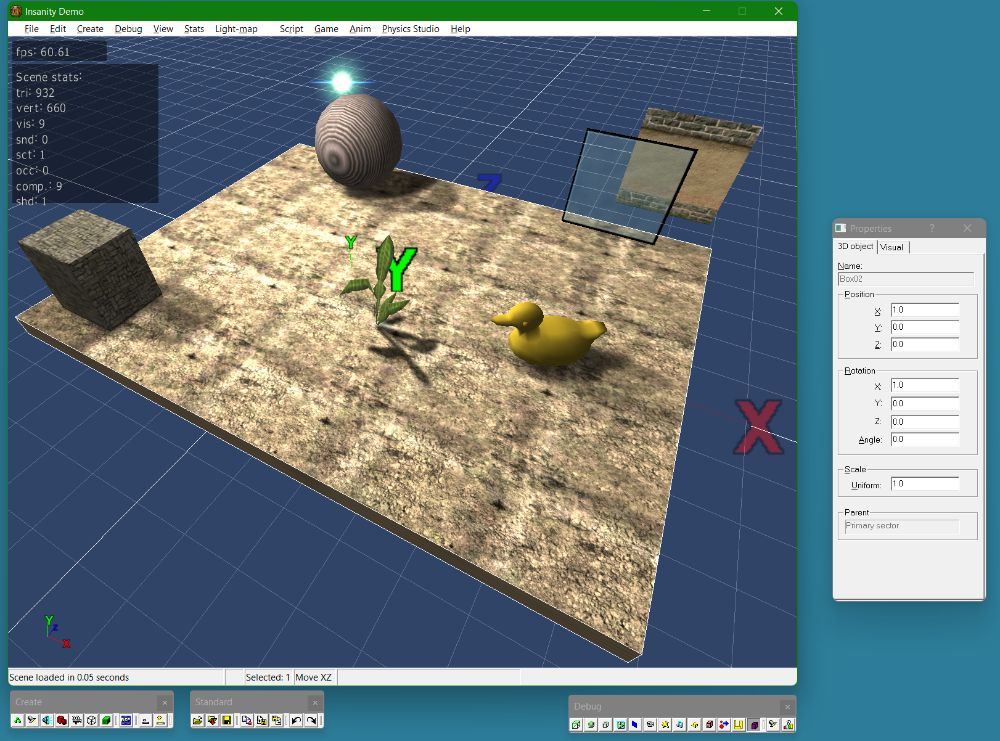

# Insanity3D

3D engine developed by Lonely Cat Games

This engine was used for PC game *Hidden and Dangerous*

It's not maintained since 2004, but it still shows some nice techniques: physics, sectors+portals, occluders, bump/detail/light/environment -mapping, human animations, BSP tree, collisions, rain, snow, level-of-detail, particles, scripting, shadows, etc.  
This was used in a real PC game!

This project can be compiled under Microsoft Visual Studio 2008  
It contains also compiled binaries, so it can be run directly without compilation (run *Editor\Bin\test.exe*) Use *Menu>File>Open mission* to load different scenes.

It runs under Windows (XP up to Windows 11, and maybe newer)

Structure of the project:

- DirectX - needed headers and libraries for DirectX
- Docs - documentation on how the engine and editor works
- Include - C++ header files
- lib - compiled libs (these can be compiled from sources)
- Source - C++ source files for all parts of engine
- Tools - compiled 3DS Max 4/7 plugins
- Editor - Editor sources and binaries
  - _src - source file
  - Bin - precompiled binaries - start the app from here
  - Maps - textures
  - Missions - 3D scenes
  - Models - 3D models
